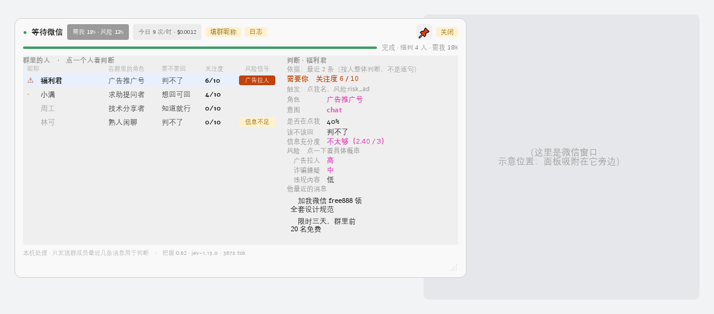
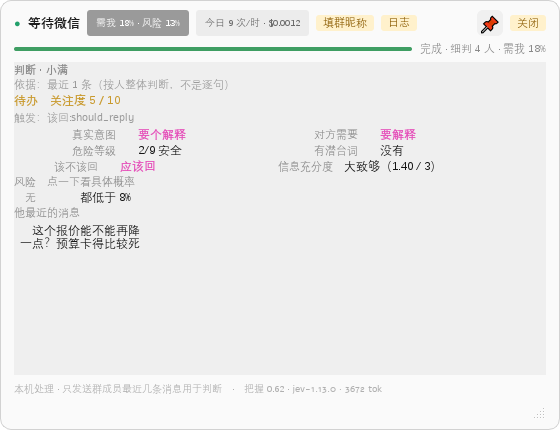
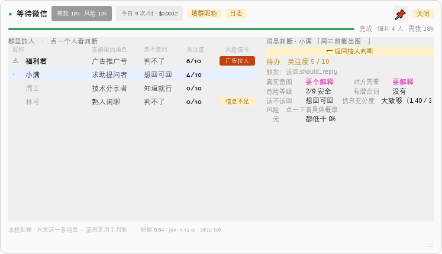
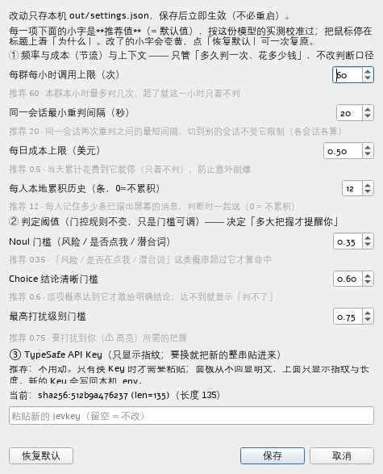

# wechat-triage-hud

**微信 PC 端「按人分诊」悬浮副驾** —— 看群里每个人在干什么，默认静默，只在明确需要你时才提示。

> **它不替你说话。** 代码里不存在任何发送消息的路径，也不会生成回复话术，最多把结论摆给你看。

A desktop triage HUD for PC WeChat group chats (Windows). It reads the open conversation by **local
offline OCR**, groups messages **by speaker**, and asks TypeSafe's Jev model what each person is doing —
staying silent unless something actually needs you. No injection into WeChat, no auto-reply.

```text
┌─ 青柠设计组项目群(39)（群）── 需我 26% · 风险 10% ── 今日 3 次 / $0.0004 ─┐
│ 群里的人 · 点一个人看判断        │ 判断 · 小满                              │
│  小满  判不了  判不了  2/10    │  待办  关注度 0 / 10                       │
│  周工     判不了  判不了   —      │  真实意图 纯闲聊      对方需要 不用做什么  │
│                                  │  危险等级 0/9 安全    有潜台词 有          │
│                                  │  该不该回 想回可回    信息充分度 2.52 / 3  │
│                                  │  他最近的消息（点一条可单独判这一条）      │
└──────────────────────────────────────────────────────────────────────────┘
```

### 长什么样（**模拟数据**）

下面所有截图都是 `tools/render_mocks.py` 用**虚构数据**离屏渲染的：人名、消息、群名全是编的，
版式与配色与真机一致。真实截图必然含聊天原文，本项目**绝不入库**（见 [SECURITY.md](SECURITY.md)）。

| | |
| :--- | :--- |
|  |  |
| 面板吸附在微信窗口旁（右侧灰块是位置示意，不是微信界面） | 私聊：左列整列隐去，自动选中对方 |
|  |  |
| 点右栏任意一条消息 → 单独判这一条（含「← 返回按人判断」） | 设置项每一项都写着推荐值与作用，改了会标黄 |

改完 UI 重跑一次 `python tools/render_mocks.py`，文档里的图就跟着更新。

---

## 目录

- [对你有什么用](#对你有什么用)
- [它是什么 / 不是什么](#它是什么--不是什么)
- [功能](#功能)
- [工作原理](#工作原理)
- [现状（诚实版）](#现状诚实版)
- [安装](#安装)
- [快速开始](#快速开始)
- [面板操作](#面板操作)
- [配置](#配置)
- [打包成 exe](#打包成-exe给别人用)
- [验证与测试](#验证与测试)
- [目录结构](#目录结构)
- [关键设计决策](#关键设计决策)
- [已知限制](#已知限制)
- [隐私](#隐私)
- [文档](#文档)
- [路线图](#路线图)
- [社区](#社区)
- [贡献](#贡献)
- [参考与致谢](#参考与致谢)
- [许可](#许可)

---

## 对你有什么用

> 写得克制一点：下面是**它确实会做的事**，以及**它做不到的**。效果层面（比如"少被打断几次"）
> 没有测过，不在这里承诺。

**不用它**：微信群、客户私聊一多，"现在有没有人在等我、这句要不要回"这件事，你得自己把聊天翻一遍才知道。

**用它**：

- **群聊：有人需要你才列出来**（需要你 / 待办 / 不用管），没人需要你时它不出声。
- **私聊：判断"这句话什么意思、要不要现在回"**：给出**真实意图 / 对方需要 / 有没有潜台词 /
  危险等级（0–9）/ 该不该回**。私聊不用点人（就一个对话，它自己盯住）。
  判据是**你和这人的关系**（客户 / 同事 / 朋友…）——同一句"能不能再降一点"，填了"客户"
  之后，结论从"判不了"变成"该回"。
- **拿不准的某一句，点一下就单独判它**（群聊私聊都能用）：不用整段重判。
- **群里混进来的广告或骗子会被标出来**：四类风险单独给分（实测广告样本 0.99；
  真机上某条群消息标为"广告拉人 91%"）。
- **它不碰你的聊天**：不注入微信、不读它的数据文件、**不替你回话**（一个字都不生成）；
  发出去的只有"被判断的那几条消息 + 你填的判据"；每次调用都留日志，可回查。

**它做不到的（别指望）**：

- **判断准不准没有标准答案可比对**。它给的是参考，不是正确答案——重要的事自己读。
- **读屏靠 OCR**：微信被别的窗口挡住或最小化时，它按设计**不判**（并在面板上写明原因）；
  OCR 偶有错字。
- **它不保证不漏**：漏报率没测过（这也是上面"效果层面不承诺"的原因）。
- **私聊这块验证得更少**：目前只有零星几组真实对照，样本太少，结论可能不稳。
- **谁不划算**：群少、都是熟人闲聊，或者你本来就一直开着微信看——装了收益很小。

## 它是什么 / 不是什么

| 是 | 不是 |
| :--- | :--- |
| 按**发言人**聚合判断：角色、意图、是否在点我、该不该回、四类风险 | 不做逐条消息的"潜台词翻译"（那是理解任务，实测答不了） |
| **两段式**分诊：先廉价粗筛全体，只对前几名细判 | 不对每个人做全量细判（39 人群一次全量 39 次调用，成本和延迟都不可接受） |
| **默认沉默**：只有"明确需要我"才进视线 | 不是消息提醒器 |
| 每次 API 调用**完整落盘**，界面上任何数字都能追溯到一次真实响应 | 不上传任何数据到自有服务器 |
| 用**场景属性**约束判断：群性质与私聊关系由用户在本机填一次并进 state | 不在代码里写死默认关系（用错默认比没有更糟） |
| 单条消息也能判（**复用私聊口径**，见 [设计决策](#关键设计决策) 第 5 条） | 不声称单条判断比按人判断更准 |

## 功能

- **按人分诊三态**：`alert`（⚠ 高亮）/ `todo`（列出不打扰）/ `silent`（一行灰字）
- **风险默认显示「高/中/低」**（点一下看具体概率）：档位锚在门控阈值上 —— 高 = ≥最高打扰门槛（单类够印证）、中 = ≥Noul 门槛（门控算命中）、低 = 其余；「信息充分度」也带等级（不太够 / 严重不足…），不再只给一个容易被读反的数字
- **切换会话快**：换群/换私聊首帧即判（免去抖），**切回看过的会话立刻显示上一轮结果**（标注时间，后台刷新）
- **两段式**：Call 1 粗筛全体 → Call 2 只细判前 K 名；门控是**代码规则**，不交给模型
- **默认沉默**，且"关注度"在有效质量不足时显示 `—`，不给伪精度
- **场景属性**：群性质（工作群/客户群/亲友群/兴趣群/陌生群/其他…）、私聊关系（客户/同事/朋友…）
  与"我在本群的昵称/职责"，进 state 的 `群.性质` / `对话.关系` / `我.身份`；未填时显式发「（未填写）」
- **点一条消息就能判这一条**（F-26）：右栏每条消息行可点，单独判这一条；缓存键含上下文指纹
- **按人累积历史**（F-25）：每人一个本机队列，滚出屏幕的消息不丢；跨重启保留
- **私聊支持**：跳过粗筛直接细判，独立问题集与门控
- **面板形态**：吸附微信 / 📌 固定 / **关闭展板 = 收成 52px 小球**（球色即状态，点球展开）/ 可拖拽调整大小；详情区常驻，折叠与退出都在右键菜单里
- **暂停与免打扰**（F-21）：全局热键 `Ctrl+Alt+H` + 托盘菜单，按下即停采集与网络
- **设置界面**（F-22）：频率、每日成本上限、门控阈值、API Key，保存即生效
- **审计日志**：每次调用一行，含**原始请求与响应字节**；Key 只落指纹
- **可观测**：三阶段进度条 + 状态行 + 失败原因直接写在面板上（"扫描不到微信：被遮挡"）

## 工作原理

```text
微信窗口
   │  ① 截屏 + 本地 OCR（不联网、不注入微信、不碰它的进程内存）
   ▼
按发言人聚合 ──── ② 抽取"谁说了什么"，附全群上下文
   │
   ▼
两段式分诊
   ├─ Call 1  粗筛：一次调用给全体发言人排序，并回答"到底需不需要有人被关注"
   └─ Call 2  细判：只对前 K 名做完整按人判断（允许全部否掉）
   │
   ▼
三态门控（**代码规则，不交给模型**）
   alert  ⚠ 风险命中，或明确的"该回/在点我"  → 高亮
   todo   · 可回可不回                        → 列出，不打扰
   silent    不必回                            → 一行灰字
   │
   ▼
悬浮面板：吸附在微信窗口旁，跟随移动/最小化/关闭，可收起成小球
```

单条消息判断走同一套：把「这一条」作为判断对象、前后几条作上下文，**复用私聊那 11 题**
（不用另造题集，也不改题面）。所有请求与响应写入 `out/jev_audit.jsonl`（**含原始字节**）。

## 现状（诚实版）

**2026-09-24。能跑、能看、数字全真、日志可查。** 最近一轮（第五轮）真机验收六套全绿：
审计日志 11 项 · 跨进程写锁 · 遮挡校验 · 面板交互 · 问题集四项指标 · 按钮/菜单/小球/消息单判自检
（无头 **151/151**、可视模式 152/152）。详细的复核记录在本机自用备忘录里（不入库）。

**未验证的照旧不弱化：**

- 判断"该不该回"**准不准没有 ground truth** —— 需要一批人工标注的真实消息（PRD 里的 Phase 0 门禁），
  目前没有。
- **场景属性对结论的影响只测过 1 组对照**（3 次真实调用）：不填关系时置信 **0.36**／门控 todo
  → 填「客户」后 **0.84**／alert。方向可信、**样本不足**，数值不可外推。
- 单条消息判断只做了**功能与成本**验证（1 次 ≈ **$0.00015**），**质量未与按人判断对比过**。

## 安装

**环境**：Windows 10/11、Python 3.10+、PC 微信 4.x（实测 4.1.15.12）、微信窗口需**可见**
（最小化到托盘时读不到）。

```bash
git clone https://github.com/ops120/wechat-triage-hud && cd wechat-triage-hud

# 方式一：按依赖清单装（推荐，含 tools/ 诊断脚本要的包）
pip install -r requirements.txt

# 方式二：装成本包（可 pip install -e . 开发模式；含控制台命令 wechat-triage-hud）
pip install -e .
```

## 快速开始

```bash
cp .env.example .env          # 填入你的 TypeSafe API Key
python -m wechat_triage_hud.hud      # 或装过包后用：wechat-triage-hud
```

首次运行会提示填写**你在该群里的昵称**（以及群聊的群性质、私聊的关系）——模型需要这些判据才能回答
"有没有人在点我名""该不该回"。**只存本机**（`out/group_meta.json`）。

## 面板操作

| 操作 | 入口 |
| :--- | :--- |
| 看某个人的判断 | 点左列任意一个人（私聊会自动选中对方） |
| **单独判某一条消息** | 点右栏「他最近的消息 / 更早的消息」里任意一行 → 点「← 返回按人判断」回退 |
| 固定位置 / 取消固定 | `📌`（固定后不再跟着微信移动） |
| 折叠 / 展开详情 | 右键菜单（标题栏的 `▴` 已按用户要求移除，详情区默认常驻） |
| **关闭展板**（收成小球） | 标题栏「关闭」按钮：面板收起、球留在屏幕上（点球展开，外环颜色=状态）；退出程序走右键菜单「退出」 |
| **看风险的具体概率** | 点右栏「风险」标题或任意一行（默认显示 高/中/低，点一下切成百分比，再点切回） |
| 填写我在本群的昵称 · 群性质 · 私聊关系 | `填群信息` / `填关系`（状态行未填时会高亮提示） |
| 看审计日志占用 / 清空 | `日志`（双击清空，4 秒防误触） |
| **收成小球** | 右键菜单「收成小球」· 托盘菜单 · 双击托盘（球色即状态，点球展开） |
| 暂停 / 免打扰 | `Ctrl+Alt+H`，或托盘菜单 |
| 设置（频率/成本/阈值/Key） | 右键菜单 →「设置…」 |
| 退出 | 右键菜单 →「退出」（标题栏的 `✕` 已按用户要求移除，避免误触） |

## 配置

| 项 | 位置 | 说明 |
| :--- | :--- | :--- |
| API Key | `.env`（gitignore） | 面板里只显示指纹，不回显明文 |
| 频率 / 成本 / 阈值 | `out/settings.json`（也可在「设置…」里改） | 见下面「可调项与推荐值」 |
| 场景属性 | `out/group_meta.json` | 群昵称 / 职责 / 群性质、私聊关系 / 身份、全局默认关系 |
| 面板外观 | `out/ui_prefs.json` | 小球形态与坐标、面板尺寸、固定状态 |
| 累积历史 | `out/speaker_history.json` | 按会话的本机消息历史（F-25） |
| 审计日志 | `out/jev_audit.jsonl` | 每次调用一行，含原始请求/响应字节 |

### 可调项与推荐值

设置界面上每一项下面都写着**推荐值（= 默认值）与作用**，鼠标停在标题上能看到"为什么"。
推荐值不是拍脑袋的，是按这份模型的**实测**校准过的 —— 不确定就别改；改坏了点「恢复默认」。
下表是代码里那份唯一来源（`wechat_triage_hud/settings.py` 的 `RANGES` + `HELP`）的镜像：

| 设置 | 推荐（默认） | 作用 | 为什么是这个值 |
| :--- | :--- | :--- | :--- |
| 每群每小时调用上限 | **60** | 本群本小时最多判几次，超了这小时只看不判 | 一次按人判断实测约 1-2 秒；60 ≈ 每分钟最多一次，正常聊天用不到 |
| 同一会话最小重判间隔（秒） | **20** | 同一会话两次重判的最短间隔；**换会话不受它限制**（各会话各算） | 防 OCR 抖动 / 刷屏导致的重复计费：没它时实测 20 秒内提交过 6 次 |
| 每日成本上限（美元） | **0.50** | 当天花到它就停（只看不判） | 一次按人判断实测 ≈ $0.0002（3571 tok），$0.5 ≈ 2500 次 |
| 每人本地累积历史（条） | **12** | 记住多少条已滚出屏幕的消息，判断时一起送（0 = 不累积） | 实测带 5 条滚出屏幕的消息：结论只微调（置信 0.58→0.59），成本 +312 tok（≈ +8%） |
| Noul 门槛 | **0.35** | 「风险 / 是否在点我 / 潜台词」的概率超过它才算命中 | 模型对这类题实测**欠自信**（T≈0.66），所以偏低 —— 宁可多报也不漏报 |
| Choice 结论清晰门槛 | **0.60** | 顶项概率达到它才敢给明确结论，否则显示「判不了」 | 模型对 Choice 类题实测**过度自信**（T≈3.29），所以不给「91%」这种假精确 |
| 最高打扰级别门槛 | **0.75** | 要打扰到你（⚠ 高亮）所需的把握 | 最高打扰级别的门槛：调高更少 ⚠，调低更容易被打扰 |

## 打包成 exe（给别人用）

打包是**在本机跑一次**的事（仓库不带 CI）：

```bat
build.bat          :: 双击即可；产物在 dist\wechat-triage-hud\
```

- **前提**：Windows + Python 3.10+ + `pip install -r requirements.txt pyinstaller`
- **产物**：`dist\wechat-triage-hud\`（实测约 **330 MB**，大头是 PySide6 与离线 OCR 模型）。
  整个文件夹拷给别人即可，`wechat-triage-hud.exe` 双击就能跑
- **数据落在 exe 旁边**（`out\` 与 `.env`），不是临时目录 —— 拷走文件夹，日志与设置跟着走
- 产物目录里已放好 `.env.example` 与 `使用说明.txt`（第一次用：改名 `.env` 填 Key）

**实测记录**（本机打包并真跑过）：exe 启动、面板窗口、托盘图标、全局热键、OCR 扫描、
遮挡判定（微信被盖住时不扫）都正常；`out\` 确实建在 exe 旁边。

**打包报错怎么办**（两个真踩过的坑）：

| 报错 | 原因与解法 |
| :--- | :--- |
| `ImportError: DLL load failed while importing _ctypes / Shiboken` | 你在 **conda 环境**里打包。conda 把 Qt / PySide6 / libffi 的 DLL 放在 `<prefix>\Library\bin`（pip 轮子才放在包内），`packaging\*.spec` 里已经针对这种情况收了一批；若还缺，改用 pip 虚拟环境最省事：`python -m venv .venv-build` → `.venv-build\Scripts\pip install -r requirements.txt pyinstaller` |
| `PermissionError: ..._internal\xxx.dll` | 上一个 exe 还在跑（窗口版崩溃时会挂着错误框），先退出或 `taskkill /F /IM wechat-triage-hud.exe` |

## 验证与测试

**两套是真离线**（不需要微信、不需要 Key、不花钱，CI 里跑的就是它们）；其余分别要真微信或真 Key。
全部都是**可重复跑的真实验证**，不是自我宣称（跑法与环境见 [tests/README.md](tests/README.md)）：

```bash
# ↓ 真离线（不联网、不花钱、不弹到屏幕上）
python tests/dev_log_concurrency_verify.py  # 跨进程写锁不交织 + fsync 按条数节流
python tests/dev_hud_buttons_verify.py      # 按钮/菜单/小球/消息单判/风险档位（无头 151 项，屏幕上零出现）
HUD_SELFCHECK_VISIBLE=1 python tests/dev_hud_buttons_verify.py   # 同一套，亲眼看它弹出来

# ↓ 要真 Key 与网络（花费极小）
python tests/dev_p1_verify.py               # 审计日志：3 次调用恰好 3 条、重试每次成条、无 Key 明文
python tests/eval_qset.py                   # 问题集四项指标（真实调用，约 $0.001 / 6 次）
python tools/prove.py                       # 对真实微信发一次调用，再把日志读回来核对

# ↓ 要真微信窗口
python tests/dev_occlusion_verify.py        # 遮挡校验阳性对照（造窗盖住微信 → 必须检出）
python tests/dev_p0_verify.py               # 面板交互（需先 JEV_HUD_DEBUG=1 启动面板）
```

想自己核对数字真伪，直接读审计日志：

```bash
python -c "import json;[print(json.loads(l)['http_status'], json.loads(l)['response']['usage']) for l in open('out/jev_audit.jsonl',encoding='utf-8')]"
```

## 目录结构

```text
wechat-triage-hud/
├── README.md  CHANGELOG.md  CONTRIBUTING.md  SECURITY.md
├── pyproject.toml             元数据 / 依赖 / 控制台入口
├── requirements.txt           依赖清单（含 tools/ 诊断脚本所需）
├── .github/                   PR 与 issue 模板
├── wechat_triage_hud/         产品代码
│   ├── paths.py                统一路径（唯一一份，禁止各自 dirname 推算）
│   ├── jev_log.py              审计日志写入器（强制、原始字节、文件锁）
│   ├── jev_engine.py           API 客户端（重试 + 每次尝试都落盘）
│   ├── qset.py                 ★ 问题集与阈值 —— 唯一权威文件，改问题只改这里
│   ├── person_engine.py        按人判断 / 单条消息判断 + 本机缓存
│   ├── triage.py               两段式分诊 + 节流
│   ├── settings.py             本机可调项（频率/成本/阈值/Key）
│   ├── wechat_capture.py       截屏 + OCR + 按发言人聚合
│   ├── wechat_window.py        微信窗口定位/还原/客户区
│   ├── assets/ball.png         小球外观（用户提供的图）
│   └── hud.py                  ★ 入口：悬浮面板
├── tests/                     可重复跑的验收（见 tests/README.md）
│   └── oneoff/                 一次性真机探针（留档不维护）
├── build.bat  packaging/       打包成 exe（PyInstaller：启动器 + spec + 用户使用说明）
├── tools/                      诊断工具（OCR 探针、控件树 dump、旧路线留档）
├── screenshots/               **样例图**（虚构数据渲染，可入库；真实截图绝不入库）
└── out/                        运行产物（gitignore，含聊天原文，绝不入库）
```

## 关键设计决策

五条都是实测逼出来的，不是偏好（细节与证据在本机自用备忘录里）：

1. **判定对象是「人」，不是「消息」。** 实测 9 条真实群消息里 8 条报"缺指代对象"
   ——"还行"回的哪句不知道。但看**一个人最近几条**，就能判断他在群里扮演什么角色。
2. **两段式分诊。** 全体粗筛只花一次调用；要不要花第二次钱，由第一次的结果决定。
3. **`risk` 拆成四个独立 Noul**（广告拉人 / 诈骗嫌疑 / 引战攻击 / 违规内容）。
   官方 TypeSafe skill 明确要求 *"use one per label when several may apply"* —— 合成一个 0–1 的分数，
   会让"有广告"和"有诈骗"无法区分，而处置方式完全不同。
4. **门控不看 confidence。** 官方文档说 confidence 只反映分布集中度、**不是行动的许可**。
   所以用独立的「信息充分度」判断：信息不足时**判断类**告警降级，但**风险类**告警照常触发
   —— 漏掉一个诈骗号的代价远大于多弹一次卡片。
5. **单条消息判断「借私聊口径」**：私聊那 11 题已在真机校准过，且"判这一句"要问的东西与私聊几乎一样；
   群聊里点消息时把群身份**映射**进题面要用的 `我.身份` / `对话.关系`，**题面一个字不改**
   —— 不新造题集，也不假装它是另一套更准的东西。

## 已知限制

- **读取靠 OCR**：微信 4.1.15.12 **不暴露 Windows 无障碍树**（置位屏幕阅读器标志 + 重启 + 激活窗口，
  全窗口 `mmui` 节点数仍为 0）。所以读不到聊天历史与引用消息，单人只发一条时仍缺指代。
  详见本机自用的需求文档 §7.0（不入库）。
- **并发限制**：微信最小化到托盘时读不到；OCR 偶有错字（标题小字号、把发言人名字误当成消息）。
- **私聊已初步支持**但样本极少，**未充分验证**（见 MEMO §2.2）。
- **合规未落地**：聊天内容会发往境外的 TypeSafe API。面向公开运营需要单独同意与跨境传输机制，
  目前**没有**同意流程，仅适合本机自用。

## 隐私

采集与判断**全部在本机**；唯一的外发是把"待判断的消息文本 + 场景属性"发给 TypeSafe 判断。
`out/jev_audit.jsonl` 含**完整聊天原文**，是本机最敏感的文件，可用面板「日志」一键清掉。
不注入微信、不读写它的进程内存、不碰它的数据文件、不自动发送任何消息。
安全与密钥处理的完整说明见 [SECURITY.md](SECURITY.md)。

## 文档

| 文档 | 内容 |
| :--- | :--- |
| [screenshots/](screenshots/) | **样例图**（虚构数据渲染）：`python tools/render_mocks.py` 重新生成 |
| [CHANGELOG.md](CHANGELOG.md) | 变更记录（Keep a Changelog 格式） |
| 自用文档（**不入库**） | PRD、工作备忘录（含真机证据）、同类实现对比、调研快照、TODO —— 含真实群名与人名，只在本地维护（见 [SECURITY.md](SECURITY.md)） |
| [CHANGELOG.md](CHANGELOG.md) | 变更记录（Keep a Changelog 格式） |

## 路线图

**没做的活统一维护在本机自用的待办清单里**（不入库；可勾选、每条带验收标准）。
当前最靠前的一项是「输出形态提案」的五条验收（结论行只说人话、依据区默认收起、
新增「建议动作」题等），等你拍板。

## 社区

本项目在 **[LINUX DO](https://linux.do/)** 社区进行开源推广，感谢社区佬友的交流、反馈与建议。

遇到问题欢迎在社区帖子里直接聊，或开 issue（提交前请先脱敏 —— 见 [SECURITY.md](SECURITY.md)：不要贴真实聊天内容与 API Key）。

## 贡献

见 [CONTRIBUTING.md](CONTRIBUTING.md)。最重要的一条：**这个项目里"能跑"不等于"已验证"** ——
任何结论都要能指向一条可复现的验证或一份真实日志。

## 参考与致谢

- **TypeSafe 官方 skill**：题集结构（一次问多题、Noul / Choice 两类口径）与"允许弃权"设计的依据。
- **[jev-chat-jarvis](https://github.com/jev-chat/jev-chat-jarvis)**（MIT）：私聊那几道题的口径与命名
  （`true_intent` / `she_needs` / `danger_level` …）以及危险等级分档（≥7 / ≥5 / ≥3）参照了它 ——
  它用一批中文标注集校准过。**本项目只借用口径，没有复制它的代码**；"关系判据"这一条采用了它的思路
  （没填时给个默认关系），但**默认留空**，没有写死。
- **[jev-chat/jev-chat-windows](https://github.com/jev-chat/jev-chat-windows)**（MIT）：同一平台
  （Windows + 微信 4.x + RapidOCR + PySide6）的工程对照。它有几个做法我们记在案、还没采用：
  Windows Graphics Capture 截屏（窗口被盖住也能截）、像素锚点定位消息区（不写死坐标、深浅主题通用）、
  采集与 OCR 跑独立子进程、PyInstaller 打包分发。
- 另有若干 Jev 生态的开源项目，作为架构取舍的参考。

本项目代码为独立实现。将来若采用上述 MIT 项目（或其它第三方）的代码，会按其许可保留版权声明与许可文本。

## 许可

[Apache License 2.0](LICENSE)（含专利授权条款）。第三方依赖各自遵循其许可
（其中 `rapidocr-onnxruntime` 为 Apache-2.0）。

> 再分发时请保留 [LICENSE](LICENSE) 与本文档中的版权声明。
