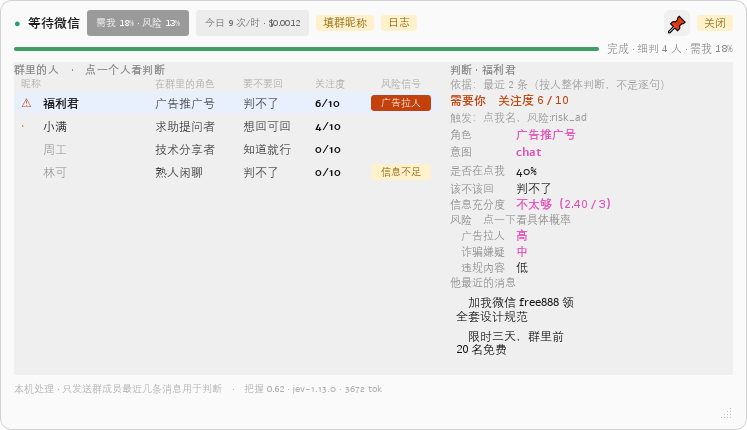
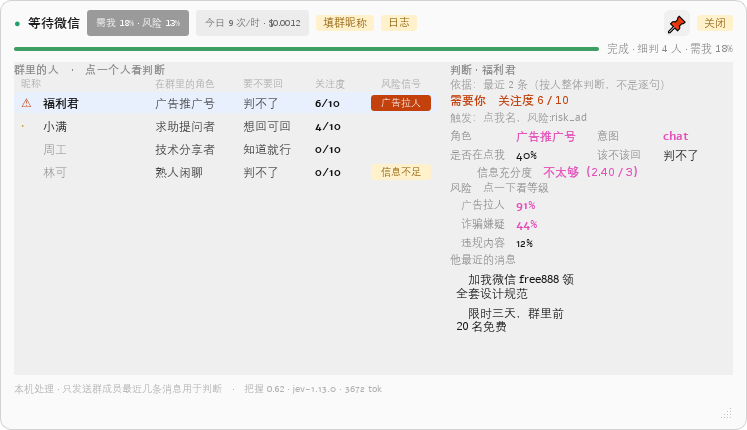
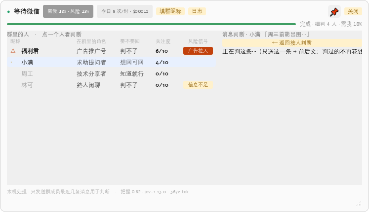

# wechat-triage-hud

[](LICENSE)
[](pyproject.toml)


**微信 PC 端「按人分诊」悬浮副驾**：读取当前打开的会话，按发言人聚合判断每个人在做什么，默认静默，只在明确需要你时才提示。

**它不替你说话。** 代码里不存在任何发送消息的路径，也不生成回复文本，最多把结论摆给你看。



A desktop triage HUD for PC WeChat group chats (Windows). It reads the open conversation by **local
offline OCR**, groups messages **by speaker**, and asks TypeSafe's Jev model what each person is doing —
staying silent unless something actually needs you. No injection into WeChat, no auto-reply.
Data flow and key handling: [SECURITY.md](SECURITY.md).

---

## 它能做什么

- **按人分诊三态**：`alert`（⚠ 高亮）/ `todo`（列出不打扰）/ `silent`（一行灰字）—— 没人需要你时它不出声。群聊回答「需要你 / 待办 / 不用管」；私聊回答「真实意图 / 对方需要 / 有没有潜台词 / 危险等级（0–9）/ 该不该回」，左列整列隐去并自动选中对方，跳过粗筛直接细判。
- **判据是你与对方的关系**：群性质（工作群 / 客户群 / 亲友群 / 兴趣群 / 陌生群…）、私聊关系（客户 / 同事 / 朋友…）、你在本群的昵称与职责由你在本机填一次，进 state 当判据；未填时显式发「（未填写）」。同一句「能不能再降一点」，填了「客户」之后结论从「判不了」变成「该回」。
- **风险单列**：广告拉人 / 诈骗嫌疑 / 引战攻击 / 违规内容四类各自给分，不合成一个总分（实测广告样本 0.99；真机上某条群消息标为「广告拉人 91%」）。默认显示「高 / 中 / 低」，点一下切换成具体概率；档位锚定在门控阈值上（高 = ≥ 最高打扰门槛，中 = ≥ Noul 门槛，低 = 其余）。
- **两段式**：第一段粗筛全体，第二段只细判前 K 名；门控是**代码规则**，不交给模型。
- **单条消息也能判**：点右栏任意一条消息单独判它，不必整段重判（复用私聊口径，缓存键含上下文指纹）。
- **按人累积历史**：每人一个本机队列，滚出屏幕的消息不丢，跨重启保留。
- **切换会话快**：换群 / 换私聊首帧即判；切回看过的会话立刻显示上一轮结果（标注时间，后台刷新）。
- **面板形态**：吸附微信窗口 / 📌 固定 /「关闭」收成 52px 小球（球色即状态，点球展开）/ 可拖拽调整大小。
- **暂停与免打扰**：全局热键 `Ctrl+Alt+H` 或托盘菜单，按下即停采集与网络。
- **设置界面**：频率、每日成本上限、门控阈值、API Key，保存即生效。
- **可观测**：三阶段进度条、状态行、失败原因直接写在面板上（「扫描不到微信：被遮挡」）。
- **可追溯**：每次 API 调用完整落盘，含**原始请求与响应字节**，Key 只落指纹；面板上任何数字都能追溯到一次真实响应。

下图为**模拟数据**渲染（`tools/render_mocks.py` 离屏生成，人名与消息全是编的，版式与配色与真机一致）：

| | | |
| :--- | :--- | :--- |
|  |  |  |
| 面板吸附在微信窗口旁（右侧灰块是位置示意） | 私聊：左列隐去，自动选中对方 | 点一条消息 → 单独判这一条（含「← 返回按人判断」） |
|  |  |  |
| 风险默认「高 / 中 / 低」，点一下切成概率 | 右栏消息行可点，单独判这一条 | 收成 52px 小球，球色即状态 |

## 适用与不适用

**适合**：微信群与客户私聊较多，需要快速知道「现在有没有人在等我、这句要不要回」。

**不适合**：群以熟人闲聊为主，或你习惯一直开着微信看消息 —— 收益很小。

效果层面（例如「少被打断几次」）没有测过，这里不做承诺。具体限制：

- **判断准不准没有标准答案可比对**：它给的是参考，不是正确答案，重要的事请自己读原文；漏报率未测过。
- **不逐句翻译潜台词**：按人判断会给出「有没有潜台词」，但不解释每句话的言外之意（那是理解任务，实测答不了）。
- **读取靠 OCR**：微信窗口被挡住或最小化到托盘时，它按设计**不判**（并在面板上写明原因）；OCR 偶有错字（标题小字号、把发言人名字误当成消息）。
- **私聊部分样本很少**，结论可能不稳。
- **合规流程未落地**，目前只适合本机自用（见 [SECURITY.md](SECURITY.md)）。

## 工作原理

```text
微信窗口
   │  ① 截屏 + 本地 OCR（不联网、不注入微信、不碰它的进程内存）
   ▼
按发言人聚合 ──── ② 抽取"谁说了什么"，附全群上下文
   │
   ▼
两段式分诊
   ├─ 第一段  粗筛：一次调用给全体发言人排序，并回答"到底需不需要有人被关注"
   └─ 第二段  细判：只对前 K 名做完整按人判断（允许全部否掉）
   │
   ▼
三态门控（代码规则，不交给模型）
   alert  ⚠ 风险命中，或明确的"该回/在点我"  → 高亮
   todo   · 可回可不回                        → 列出，不打扰
   silent    不必回                            → 一行灰字
   │
   ▼
悬浮面板：吸附在微信窗口旁，跟随移动/最小化/关闭，可收起成小球
```

单条消息判断走同一套：把「这一条」作为判断对象、前后几条作上下文，**复用私聊那 11 题**
（不另造题集，也不改题面）。所有请求与响应写入 `out/jev_audit.jsonl`（**含原始字节**）。

## 安装与运行

**环境**：Windows 10/11、Python 3.10+、PC 微信 4.x（实测 4.1.15.12），微信窗口需**可见**
（最小化到托盘时读不到）。

```bash
git clone https://github.com/ops120/wechat-triage-hud && cd wechat-triage-hud

# 方式一：按依赖清单装（推荐，含 tools/ 诊断脚本要的包）
pip install -r requirements.txt

# 方式二：装成本包（可 pip install -e . 开发模式；含控制台命令 wechat-triage-hud）
pip install -e .

cp .env.example .env                # 填入你的 TypeSafe API Key
python -m wechat_triage_hud.hud     # 或装过包后用：wechat-triage-hud
```

首次运行会提示填写**你在该群里的昵称**（以及群聊的群性质、私聊的关系）—— 模型需要这些判据才能回答
「有没有人在点我名」「该不该回」。只存本机（`out/group_meta.json`）。

## 面板操作

| 操作 | 入口 |
| :--- | :--- |
| 看某个人的判断 | 点左列任意一个人（私聊会自动选中对方） |
| **单独判某一条消息** | 点右栏「他最近的消息 / 更早的消息」里任意一行 → 点「← 返回按人判断」回退 |
| 固定位置 / 取消固定 | `📌`（固定后不再跟着微信移动） |
| 折叠 / 展开详情 | 右键菜单（详情区默认常驻） |
| **关闭展板**（收成小球） | 标题栏「关闭」按钮：面板收起、球留在屏幕上（点球展开，外环颜色 = 状态） |
| **看风险的具体概率** | 点右栏「风险」标题或任意一行（在「高 / 中 / 低」与百分比之间切换） |
| 填写我在本群的昵称 · 群性质 · 私聊关系 | `填群信息` / `填关系`（状态行未填时会高亮提示） |
| 看审计日志占用 / 清空 | `日志`（双击清空，4 秒防误触） |
| **收成小球** | 右键菜单「收成小球」· 托盘菜单 · 双击托盘（球色即状态，点球展开） |
| 暂停 / 免打扰 | `Ctrl+Alt+H`，或托盘菜单 |
| 设置（频率 / 成本 / 阈值 / Key） | 右键菜单 →「设置…」 |
| 退出 | 右键菜单 →「退出」（标题栏不放退出与折叠按钮，避免误触） |

## 配置

| 项 | 位置 | 说明 |
| :--- | :--- | :--- |
| API Key | `.env`（gitignore） | 面板里只显示指纹，不回显明文 |
| 频率 / 成本 / 阈值 | `out/settings.json`（也可在「设置…」里改） | 见下面「可调项与推荐值」 |
| 场景属性 | `out/group_meta.json` | 群昵称 / 职责 / 群性质、私聊关系 / 身份、全局默认关系 |
| 面板外观 | `out/ui_prefs.json` | 小球形态与坐标、面板尺寸、固定状态 |
| 累积历史 | `out/speaker_history.json` | 按会话的本机消息历史 |
| 审计日志 | `out/jev_audit.jsonl` | 每次调用一行，含原始请求 / 响应字节 |


### 可调项与推荐值

设置界面每一项下面都写着**推荐值（= 默认值）与作用**，鼠标停在标题上可看详细说明。默认值经实测校准，
改坏了点「恢复默认」。下表与设置界面同源（`wechat_triage_hud/settings.py`）：

| 设置 | 推荐（默认） | 作用 | 为什么是这个值 |
| :--- | :--- | :--- | :--- |
| 每群每小时调用上限 | **60** | 本群本小时最多判几次，超了这小时只看不判 | 一次按人判断实测约 1-2 秒；60 ≈ 每分钟最多一次，正常聊天频率用不到 |
| 同一会话最小重判间隔（秒） | **20** | 同一会话两次重判的最短间隔；**换会话不受它限制**（各会话各算） | 防 OCR 抖动 / 刷屏导致的重复计费：没它时实测 20 秒内提交过 6 次 |
| 每日成本上限（美元） | **0.50** | 当天花到它就停（只看不判） | 一次按人判断实测 ≈ $0.0002（3571 tok），$0.5 ≈ 2500 次 |
| 每人本地累积历史（条） | **12** | 记住多少条已滚出屏幕的消息，判断时一起送（0 = 不累积） | 实测带 5 条滚出屏幕的消息：结论只微调（置信 0.58→0.59），成本 +312 tok（≈ +8%） |
| Noul 门槛 | **0.35** | 「风险 / 是否在点我 / 潜台词」的概率超过它才算命中 | 模型对这类题实测**欠自信**（T≈0.66），所以偏低 —— 宁可多报也不漏报 |
| Choice 结论清晰门槛 | **0.60** | 顶项概率达到它才敢给明确结论，否则显示「判不了」 | 模型对 Choice 类题实测**过度自信**（T≈3.29），因此不给精确到个位的百分比 |
| 最高打扰级别门槛 | **0.75** | 要打扰到你（⚠ 高亮）所需的把握 | 调高更少 ⚠，调低更容易被打扰 |

## 打包成 exe

打包是在本机跑一次的事（仓库不带 CI）：

```bat
build.bat          :: 双击运行；产物在 dist\wechat-triage-hud\
```

- **前提**：Windows + Python 3.10+ + `pip install -r requirements.txt pyinstaller`
- **产物**：`dist\wechat-triage-hud\`（实测约 **550 MB**，大头是 PySide6 与离线 OCR 模型）。
  整个文件夹拷给他人即可，`wechat-triage-hud.exe` 双击就能跑
- **数据落在 exe 旁边**（`out\` 与 `.env`），不是临时目录 —— 拷走文件夹，日志与设置跟着走
- `build.bat` 会把 `.env.example` 与 `使用说明.txt` 一并放进产物目录（第一次用：改名 `.env` 并填 Key）；
  直接用 `python -m PyInstaller` 打包则不会有这两个文件

**打完包先跑这条自检**（不依赖微信窗口，直接验 OCR 引擎能不能用）：

```bat
dist\wechat-triage-hud\wechat-triage-hud.exe --selftest-ocr
```

结果写在 `out\selftest_ocr.txt`（识别到几段文字），退出码 0 = 通过。

> **别只测"能启动"。** 我们踩过：exe 能开、窗口/托盘/热键都正常，唯独 OCR 起不来 ——
> `AttributeError: module 'ch_ppocr_v3_det' has no attribute 'TextDetector'`，
> 原因是 spec 只 `collect_data_files` 收了 rapidocr 的**数据文件**、没收它的**子模块**
> （识别器是运行时按名字 import 的）。现在改成 `collect_all`（数据 + 二进制 + 子模块）
> 并靠上面这条自检守住。第一次打包时我只验了"exe 能启动"，扫描又恰好被遮挡校验拦在 OCR 之前，
> 于是这条漏了 —— 用户先撞到的。

实测记录：`--selftest-ocr` 通过（识别出「你好 hello 123」）；exe 启动、面板窗口、托盘图标、
全局热键、遮挡判定（微信被盖住时不扫）均正常，`out\` 确实建在 exe 旁边。

打包报错时（两个实际踩过的坑）：

- **`ImportError: DLL load failed while importing _ctypes / Shiboken`** —— 你在 **conda 环境**里打包：
  conda 把 Qt / PySide6 / libffi 的 DLL 放在 `<prefix>\Library\bin`（pip 轮子才放在包内），
  `packaging/wechat-triage-hud.spec` 已按文件名收集了一批；若还缺，改用 pip 虚拟环境最省事：
  `python -m venv .venv-build` → `.venv-build\Scripts\pip install -r requirements.txt pyinstaller`
- **`PermissionError: ..._internal\xxx.dll`** —— 上一个 exe 还在跑（窗口版崩溃时会挂着错误框）：
  先退出，或 `taskkill /F /IM wechat-triage-hud.exe`

## 隐私

采集与判断**全部在本机**；唯一的外发是把「待判断的消息文本 + 场景属性」发给 TypeSafe API
（境外，每个问题一次调用）—— 除它之外没有别的出网路径，本项目也没有自有服务器。
**不注入微信**、不读写它的进程内存、不碰它的数据文件、**不发送任何消息**。

`out/jev_audit.jsonl` 含**完整聊天原文**，是本机最敏感的文件，可用面板「日志」一键清空。
API Key 只放 `.env`，面板与审计日志里只出现指纹。数据流、敏感文件清单与合规现状见
[SECURITY.md](SECURITY.md)。

## 项目状态

**版本 0.1.0（2026-09-24）。** 真机验收 6 套全部通过：审计日志 11 项 · 跨进程写锁 · 遮挡校验 ·
面板交互 · 问题集四项指标 · 按钮 / 菜单 / 小球 / 消息单判自检（离线套件无头 151 项、可视模式 152 项）。
跑法与前置条件见 [tests/README.md](tests/README.md)。

**尚未验证 / 已知限制**：

- 判断「该不该回」**准不准没有 ground truth** —— 需要一批人工标注的真实消息，目前没有。
- **场景属性对结论的影响只测过 1 组对照**（3 次真实调用）：不填关系时置信 **0.36** / 门控 todo
  → 填「客户」后 **0.84** / alert。方向可信，**样本不足**，数值不可外推。
- 单条消息判断只做了**功能与成本**验证（1 次 ≈ **$0.00015**），**质量未与按人判断对比过**。
- **私聊样本极少**，未充分验证。
- 微信 4.1.15.12 **不暴露 Windows 无障碍树**（置位屏幕阅读器标志 + 重启 + 激活窗口，
  全窗口 `mmui` 节点数仍为 0），所以读不到聊天历史与引用消息，单人只发一条时仍缺指代。
- **合规未落地**：聊天内容会发往境外 API，面向公开运营需要单独同意与跨境传输机制，
  目前**没有**同意流程，仅适合本机自用。

未完成的工作见下面的「路线图」。

## 关键设计决策

以下取舍均来自实测结论，不是偏好：

1. **判定对象是「人」，不是「消息」。** 实测 9 条真实群消息里 8 条报「缺指代对象」
   ——「还行」回的哪句不知道。但看**一个人最近几条**，就能判断他在群里扮演什么角色。
2. **两段式分诊。** 全体粗筛只花一次调用；要不要花第二次钱，由第一次的结果决定。
   （39 人群一次全量细判是 39 次调用，成本与延迟都不可接受。）
3. **`risk` 拆成四个独立 Noul**（广告拉人 / 诈骗嫌疑 / 引战攻击 / 违规内容）。
   官方 TypeSafe skill 明确要求 *"use one per label when several may apply"* —— 合成一个 0–1 的分数，
   会让「有广告」和「有诈骗」无法区分，而处置方式完全不同。
4. **门控不看 confidence。** 官方文档说 confidence 只反映分布集中度、**不是行动的许可**。
   所以用独立的「信息充分度」判断：信息不足时**判断类**告警降级，但**风险类**告警照常触发
   —— 漏掉一个诈骗号的代价远大于多弹一次卡片。
5. **单条消息判断「借私聊口径」**：私聊那 11 题已在真机校准过，且「判这一句」要问的东西与私聊几乎一样；
   群聊里点消息时把群身份**映射**进题面要用的 `我.身份` / `对话.关系`，**题面一个字不改**
   —— 不新造题集，也不假装它是另一套更准的东西。

## 验证与测试

其中两套**真离线**：不需要微信、不需要 Key、不花钱。其余分别需要真微信窗口或真 Key。
跑法与环境见 [tests/README.md](tests/README.md)。

```bash
# ↓ 真离线（不联网、不花钱、不弹到屏幕上）
python tests/dev_log_concurrency_verify.py  # 跨进程写锁不交织 + fsync 按条数节流
python tests/dev_hud_buttons_verify.py      # 按钮/菜单/小球/消息单判/风险档位（无头 151 项）
HUD_SELFCHECK_VISIBLE=1 python tests/dev_hud_buttons_verify.py   # 同一套，可视化运行

# ↓ 要真 Key 与网络（花费极小）
python tests/dev_p1_verify.py               # 审计日志：3 次调用恰好 3 条、重试每次成条、无 Key 明文
python tests/eval_qset.py                   # 问题集四项指标（真实调用，约 $0.001 / 6 次）
python tools/prove.py                       # 对真实微信发一次调用，再把日志读回来核对

# ↓ 要真微信窗口
python tests/dev_occlusion_verify.py        # 遮挡校验阳性对照（造窗盖住微信 → 必须检出）
python tests/dev_p0_verify.py               # 面板交互（需先 JEV_HUD_DEBUG=1 启动面板）
```

想自己核对数字，直接读审计日志：

```bash
python -c "import json;[print(json.loads(l)['http_status'], json.loads(l)['response']['usage']) for l in open('out/jev_audit.jsonl',encoding='utf-8')]"
```

## 目录结构

```text
wechat-triage-hud/
├── README.md  CHANGELOG.md  CONTRIBUTING.md  SECURITY.md
├── pyproject.toml             元数据 / 依赖 / 控制台入口
├── requirements.txt           依赖清单（含 tools/ 诊断脚本所需）
├── .env.example               Key 与配置模板
├── .github/                   PR 与 issue 模板
├── wechat_triage_hud/         产品代码
│   ├── paths.py               统一路径（唯一一份，禁止各自 dirname 推算）
│   ├── jev_log.py             审计日志写入器（强制、原始字节、文件锁）
│   ├── jev_engine.py          API 客户端（重试 + 每次尝试都落盘）
│   ├── qset.py                ★ 问题集与阈值 —— 唯一权威文件，改问题只改这里
│   ├── person_engine.py       按人判断 / 单条消息判断 + 本机缓存
│   ├── triage.py              两段式分诊 + 节流
│   ├── settings.py            本机可调项（频率 / 成本 / 阈值 / Key）
│   ├── wechat_capture.py      截屏 + OCR + 按发言人聚合
│   ├── wechat_window.py       微信窗口定位 / 还原 / 客户区
│   ├── assets/ball.png        小球外观
│   └── hud.py                 ★ 入口：悬浮面板
├── tests/                     可重复跑的验收（见 tests/README.md）
│   └── oneoff/                一次性真机探针（留档不维护）
├── build.bat  packaging/      打包成 exe（PyInstaller：启动器 + spec + 使用说明）
├── tools/                     诊断工具（OCR 探针、控件树 dump、模拟图渲染）
├── screenshots/               截图（虚构数据渲染）
└── out/                       运行产物（gitignore，含聊天原文）
```

## 文档

| 文档 | 内容 |
| :--- | :--- |
| [screenshots/](screenshots/) | 截图：`python tools/render_mocks.py` 用虚构数据重新生成 |
| [SECURITY.md](SECURITY.md) | 数据流、密钥处理、本机敏感文件、合规现状 |
| [CHANGELOG.md](CHANGELOG.md) | 变更记录（Keep a Changelog 格式） |
| [tests/README.md](tests/README.md) | 验收脚本的跑法与前置条件 |
| [CONTRIBUTING.md](CONTRIBUTING.md) | 开发环境、提交前检查、代码约定 |

## 支持与社区

本项目在 [LINUX DO](https://linux.do/) 社区发布，感谢社区用户的交流、反馈与建议。
问题可在社区帖子或 [issue](https://github.com/ops120/wechat-triage-hud/issues) 中反馈；
贴日志前请先脱敏 —— 不要贴真实聊天内容与 API Key（见 [SECURITY.md](SECURITY.md)）。

## 贡献

贡献流程、开发环境与验证要求见 [CONTRIBUTING.md](CONTRIBUTING.md)；
参与本项目即表示同意 [CODE_OF_CONDUCT.md](CODE_OF_CONDUCT.md)。

## 路线图

还没做的活（按优先级）：

- 「输出形态提案」的验收：结论行只说人话、依据区默认收起、两类概率两种展示、新增「建议动作」题、可追溯不变。
- 判断质量的 ground truth 验证（需要一批人工标注的真实消息）。
- 合规：同意流程与跨境传输说明。

已发布的变更见 [CHANGELOG.md](CHANGELOG.md)；想做的新功能也可以直接开 issue。

## 参考与致谢

- **TypeSafe 官方 skill**：题集结构（一次问多题、Noul / Choice 两类口径）与「允许弃权」设计的依据。
- **[jev-chat-jarvis](https://github.com/jev-chat/jev-chat-jarvis)**（MIT）：私聊那几道题的口径与命名
  （`true_intent` / `she_needs` / `danger_level` …）以及危险等级分档（≥7 / ≥5 / ≥3）参照了它 ——
  它用一批中文标注集校准过。**本项目只借用口径，没有复制它的代码**；「关系判据」这一条采用了它的思路
  （没填时给个默认关系），但**默认留空**，没有写死。
- **[jev-chat/jev-chat-windows](https://github.com/jev-chat/jev-chat-windows)**（MIT）：同一平台
  （Windows + 微信 4.x + RapidOCR + PySide6）的工程对照。它有几个做法我们记在案、还没采用：
  Windows Graphics Capture 截屏（窗口被盖住也能截）、像素锚点定位消息区（不写死坐标、深浅主题通用）、
  采集与 OCR 跑独立子进程、PyInstaller 打包分发。
- 另有若干 Jev 生态的开源项目，作为架构取舍的参考。

本项目代码为独立实现。将来若采用上述 MIT 项目（或其它第三方）的代码，会按其许可保留版权声明与许可文本。

## 许可

[Apache License 2.0](LICENSE)（含专利授权条款）。第三方依赖各自遵循其许可
（其中 `rapidocr-onnxruntime` 为 Apache-2.0）。

> 再分发时请保留 [LICENSE](LICENSE) 与本文档中的版权声明。
